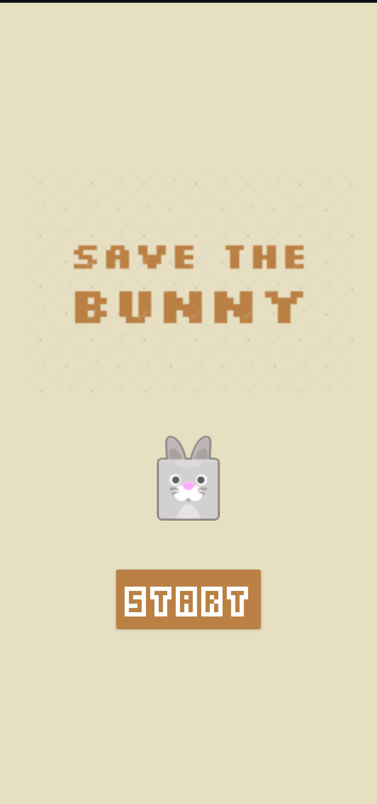
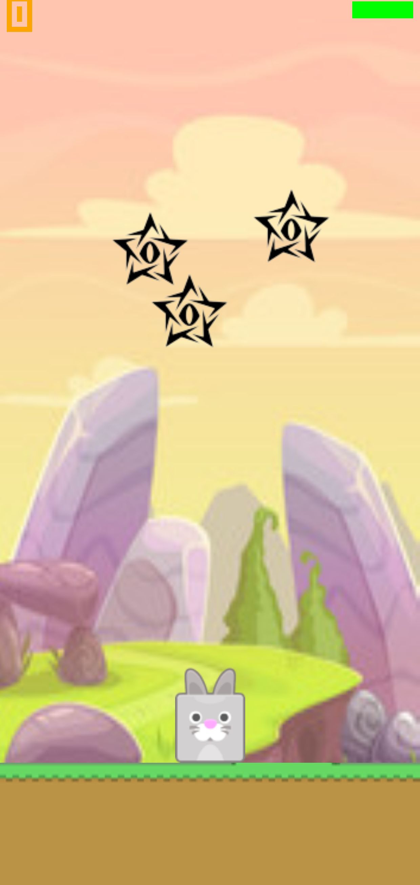
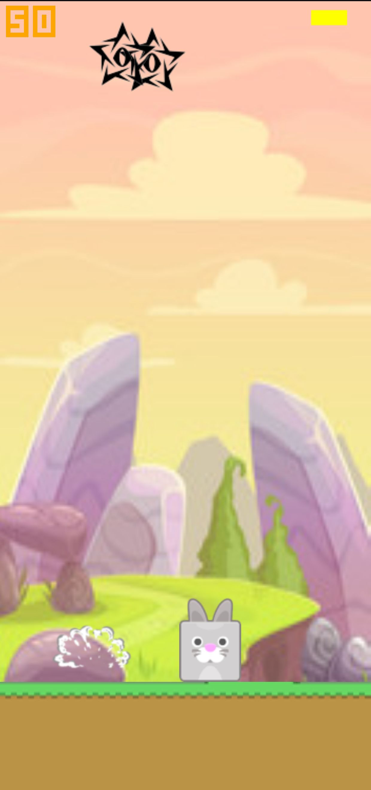
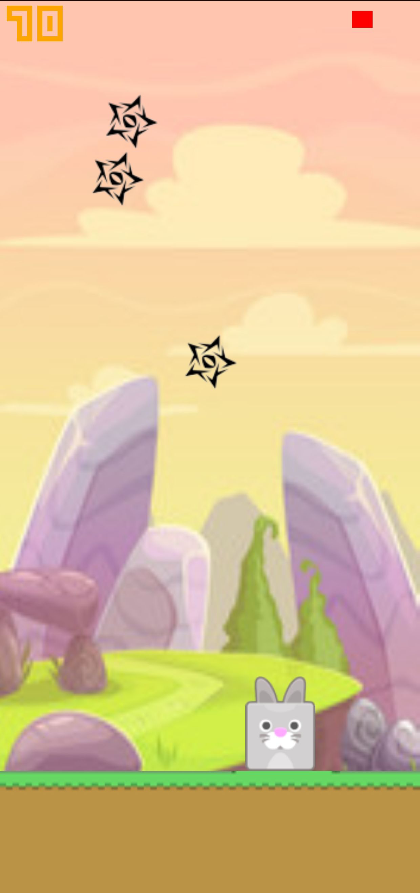
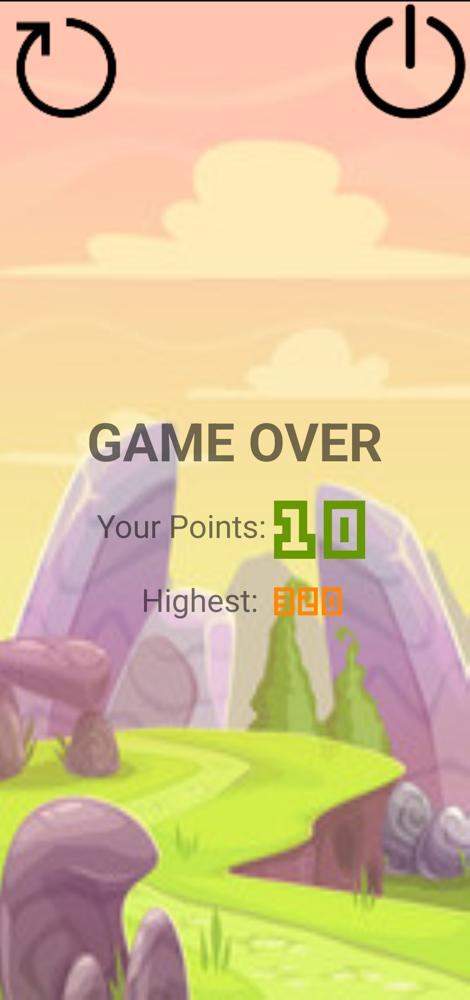

<h1>Save The Bunny - A Basic 2D Android Game</h1>

<h2>Overview</h2>

<strong>SaveTheBunny</strong> is a simple 2D game created in Android Studio using Java. The objective of the game is to move the Bunny left and right to avoid falling spikes. The player starts with 3 lives, and the game ends when all lives are lost. The game also tracks and displays the player's high score.

<h2>Features</h2>
<ul>
  <li><strong>Character Movement:</strong> The player can move the character left and right to avoid the falling spikes.</li>
  <li><strong>Falling Spikes:</strong> Spikes fall from the sky at varying speeds and positions, adding to the challenge.</li>
  <li><strong>Lives System:</strong> The player has 3 lives. Each time a spike hits the character, one life is lost.</li>
  <li><strong>High Score System:</strong> The game tracks and displays the player's highest score achieved in any session.</li>
  <li><strong>Game Over:</strong> The game ends when all lives are lost, and the final score is displayed.</li>
</ul>

## 📸 Screenshots  

### Start Page  
  

### Game Play 
    

### End Page
  
